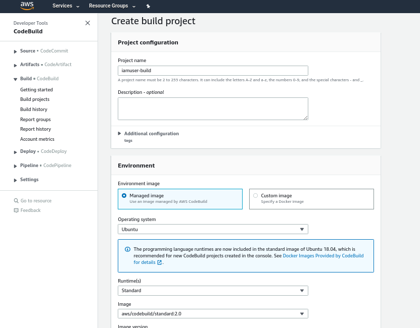
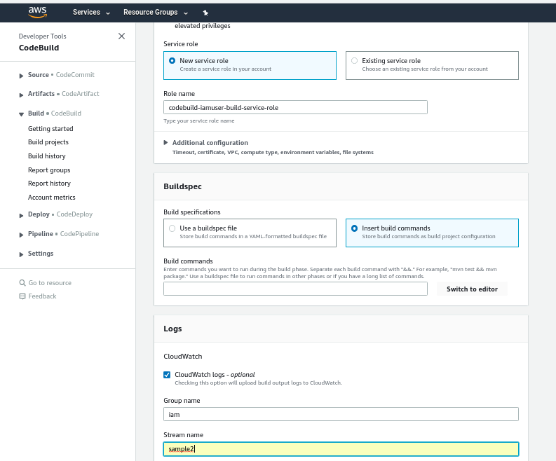
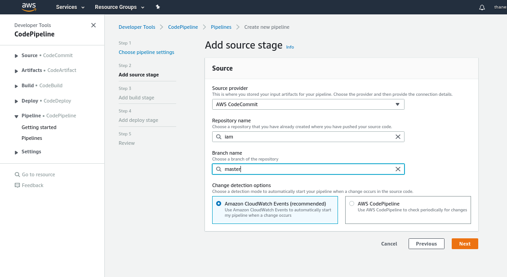
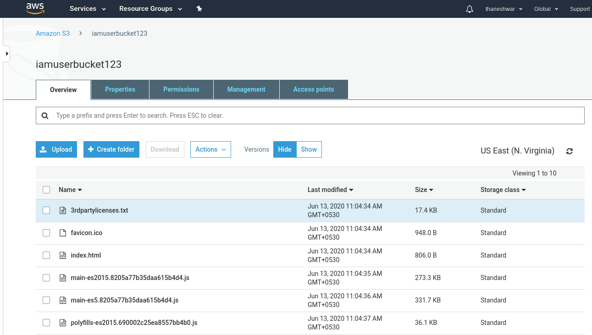

# AWS Serverless Application To Manage IAM Users Using Java Angular
# Hosting Through Codepipeline. 

AWS Serverless application to Manage IAM users:- I have created a full-stack application to perform CRUD operation in IAM user, sync with Dynamodb table, and hosting is done through CodePipeline. 

<h2>Backend Serverless Application:</h2>

 - The backend code in java(spring boot)
   - https://spring.io/projects/spring-boot

- We will need to use AWS SDK to connect to the AWS account and do IAM users related operations. 
  - https://docs.aws.amazon.com/AWSJavaSDK/latest/javadoc/
  
  SDK for Dynamodb
  - https://mvnrepository.com/artifact/com.amazonaws/aws-java-sdk-dynamodb
  
  SDK for IAM
  - https://mvnrepository.com/artifact/com.amazonaws/aws-java-sdk-iam
  
  SDK for Secretsmanager
  - https://mvnrepository.com/artifact/com.amazonaws/aws-java-sdk-secretsmanager

- The data will be stored in DynamoDB table.
  - https://docs.aws.amazon.com/sdk-for-java/v1/developer-guide/examples-dynamodb.html 

<h3>Requirement:</h3>

- We need to create some APIs

- Sync IAM users (This will get all the IAM users from the AWS account and add them to dynamodb. Remove old users to avoid duplication.)
 
- List IAM users (This will get all the IAM users from Dynamodb and return as json)

- Show single IAM user details (This will get 1 IAM user detail for which the details requested from DynamoDB)

- Delete IAM user (This will delete the IAM user from AWS then accordingly user also deleted from DyanmoDB and do sync again)

- Create IAM user (This will create new IAM user in AWS account and do sync again)

- Before that need few configurations 
  - Dyanmodb Configuration:- Here we can configure the dynamodb mapper for that we need credentials of aws dynamodb, for that we need to create one IAM User as an Administrator Access for programatic and aws cli to secure the root access and create one ploicy for Dynamodb access which is used in dynamodb mapper this is included in properties file  or the secure way we can use    AWS Security Manager for that we need another configuration which is a key management service(KMS)
    IAM
    - https://docs.aws.amazon.com/IAM/latest/UserGuide/id_users_create.html#id_users_create_console
    KMS
    - https://docs.aws.amazon.com/kms/latest/developerguide/overview.html
    
  - This configuration is placed in config package in my project
  - If we get some error like CommandLineRunner- invalid access id - (403) then 
  - Try need to install aws cli on terminal configuration given bellow
  <pre>
    curl "https://awscli.amazonaws.com/awscli-exe-linux-x86_64.zip" -o "awscliv2.zip"
   
    unzip awscliv2.zip
    
    aws configure set aws_access_key_id        value
    aws configure set aws_secret_access_key    value
    aws configure set default.region           value
    
   </pre> 
<h2>Frontend:</h2>

We can create frontend using preferably angular or any other technology you like. This will be deployed on S3.

https://www.techiediaries.com/angular/angular-9-8-tutorial-by-example-rest-crud-apis-http-get-requests-with-httpclient/

https://www.djamware.com/post/5d8d7fc10daa6c77eed3b2f2/angular-8-tutorial-rest-api-and-httpclient-examples

https://www.youtube.com/playlist?list=PLqq-6Pq4lTTb7JGBTogaJ8bm7f8VCvFkj

- Single Page IAM user list table. Show all IAM users. (List IAM user api will be called)

- Each User row will have 2 buttons, More, Delete

- More button will show all the user details (Will call Show single IAM user details API)

- Delete the IAM user button click calls the delete API. (Will call Show delete IAM user API)

- There will be a Create button on the page. This will open a pop asking User details. (Will call the Create IAM user API)

<h1>Hosting</h1>
<h2>Backend:</h2>
Here Hosting is done through code pipline which is further divided into three phases

  <h4>CodeCommit:</h4> Here we need to create or configure the source repository by simple click and next operation, but before that you need to create some role along with policy such as awsCodeCommit,awsCodeBuild,awsCodeDeploy and ec2, access is depends on you'r requirment.
  
  
  
  
  
  
  <h6>Fig_1.1 Creation of new repository</h6>
  
  
     
 
 
  
  
  <h6>Fig_1.2 Clone the repo</h6>
  
  
     
  
  
  
  
  <h4>CodeBuild:</h4> Here we need to configure build process along with buildspec.yml file where we can also use external or different yml file but for this situation we need to put the file name in required field.
  
  
  
  
  
  
  
  <h6>Fig_2.1 Create Build</h6>
  
  
   
 
  
  
  
  <h6>Fig_2.2 Setting Environment</h6>
  
  
    
  
  
  buildspec.yml
  <pre>
    version: 0.2

    phases:
      install:
        runtime-versions:
          java: openjdk11

      build:
        commands:
          - echo if we  get error like CommandlineRunner - invalid access id (403) then we need to insatll aws cli given below
          - curl "https://awscli.amazonaws.com/awscli-exe-linux-x86_64.zip" -o "awscliv2.zip"
          - unzip awscliv2.zip
          - aws configure set aws_access_key_id          value
          - aws configure set aws_secret_access_key      value
          - aws configure set default.region             value
          - mvn install

    artifacts:
      files:
        - target/*.jar
        - scripts/*.sh
        - appspec.yml
        - s3 sync target/*.jar s3://bucketname/*.jar
      discard-paths: yes

    cache:
      paths:
        - paths
  
  </pre>
  
  <h4>CodeDeploy:</h4> Here we need configure the deployment field along with appspec.yml file this file will come along with with source file, so you need to filter that file from source file by configuring the filename in buildspec.yml file.
  
  
  
  
  
  <h6>Fig_3.1 Create Deploy</h6>
  
  
    
  
  
  
  
  
  <h6>Fig_3.2 Create Group</h6>
  
  
    
 
  appspec.yml
  <pre>
    version: 0.0
    os: linux
    files:
      - source: /
        destination: /home/ec2-user
    hooks:
      AfterInstall:
        - location: fix_previleges.sh
          timeout: 300
          runas: root
      ApplicationStart:
        - location: start_server.sh
          timeout: 300
          runas: root
      ApplicationStop:
        - location: stop_server.sh
          timeout: 300
          runas: root
 </pre>
 
 
 - Some script file also required to run the deployemt 
 
 <pre>
  fix_previlages.sh
  
    #!/bin/bash
    chmod +x /home/ec2-user/iam-0.0.6-SNAPSHOT.jar
    chmod +x /home/ec2-user/start_server.sh
    chmod +x /home/ec2-user/stop_server.sh

 </pre>
 
 
 <pre>
  start_server.sh
  
      #!/bin/bash
      
      #if we get error like CommandLineRunner: invalid access id -(403) then need to install aws cli and configure
      curl "https://awscli.amazonaws.com/awscli-exe-linux-x86_64.zip" -o "awscliv2.zip"
      unzip awscliv2.zip

      aws configure set aws_access_key_id         value
      aws configure set aws_secret_access_key     value
      aws configure set default.region            value

      wget https://download.java.net/openjdk/jdk11/ri/openjdk-11+28_linux-x64_bin.tar.gz
      tar -xvzf openjdk-11+28_linux-x64_bin.tar.gz
      export JAVA_HOME=/home/ec2-user/jdk-11
      export PATH=$PATH:$JAVA_HOME/bin

      java -jar  -Dspring.profiles.active=dev /home/ec2-user/iam-0.0.6-SNAPSHOT.jar > /dev/null 2> /dev/null < /dev/null &

 </pre>
 
 <pre>
  stop_server.sh
  
    #!/bin/bash
    pkill -f 'java -jar'
 
 </pre>
 
  
  - Make sure to create one tag which is used in ec2 instance creation phase.
  
  - Create the ec2 instance and use the created tag and iamroll
    - https://docs.aws.amazon.com/efs/latest/ug/gs-step-one-create-ec2-resources.html
  - After creation of ec2 instance we need to install codedeployagent
    - https://docs.aws.amazon.com/codedeploy/latest/userguide/codedeploy-agent-operations-install.html
    
  Now, Let's configure the CodePipline which connect the all pheses in single pipe like architecture.
  After creation of pipeline it will automatically start to perform each phase one by one until we get some error and complete the task, if any phase get some error then pipeline will stoped on to this phase and not go to next phase until we resolve the error.
  
  
  
  
  
  <h6>Fig_4.1 Create Pipeline</h6>
  
  
     
  
  
  
  
  <h6>Fig_4.2 Add Source</h6>
  
  
    
  
  
  
  
  
  <h6>Fig_4.3 Add Build</h6>
  
  
     
  
  
  
  
  
  <h6>Fig_4.4 Add Deploy</h6>
  
     
  
  
  
  
  <h6>Fig_4.5 Pipeline Process</h6>
     
  

 

<h2>Frontend:</h2> 
Similer operation is done into this phase with minner change on to buildspac.yml and no need to CodeDeploy Phase becuase s3 provide some feature to automatically deploy and host the html file.

buildspec.yml
<pre>
 
version: 0.2

phases:
  install:
    runtime-versions:
        nodejs: 10
        
    commands:
        - npm install
        - npm install -g @angular/cli
    
  build:
    commands:
        - ng build --prod
     
  post_build:
    commands:
        - aws s3 sync ./dist/iamuser-app s3://angularbucketname --acl 'public-read'
    
artifacts:
  files:
    - '**/*'
  
  discard-paths: yes
  base-directory: 'dist*'

</pre>

S3 provide static web Hosting where we can host our simple app in only few clicks

 

  
  
  <h6>Fig_5.1 S3 Bucket have list of files</h6>
     
  
  
  
  
  
  
  <h6>Fig_5.2 Here we go to properties section</h6>
     

  
  
  <h6>Fig_5.3 configure static web host and Hit endpoint</h6>
     

